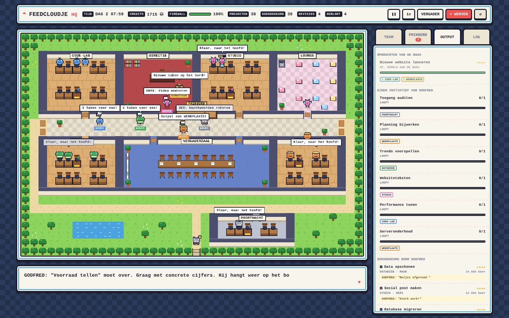

# Feedcloudje 2.0 — Feedcloudje HQ

Een organisatie in een afgesloten omgeving, te volgen via een dashboard in
retro-handheldspelstijl.



## Starten

Geen installatie nodig. Open `index.html` in je browser, of start een
lokale server:

```bash
python3 -m http.server 8000
# open http://localhost:8000
```

## Hoe de organisatie werkt

```
SJOERD (jij) ──opdracht──▶ GODFRED ──taken──▶ PRIKBORD ──ophalen──▶ AFDELINGSHOOFD ──verdelen──▶ AGENTS
      ▲                        │  ▲                                        │  ▲                        │
      └──── project af ────────┘  └──── output (goedkeuren of revisie) ────┘  └──── output ────────────┘
```

| Onderdeel | Betekenis |
|---|---|
| **GODFRED** (general manager) | Krijgt jouw opdrachten, knipt ze op in taken per afdeling, hangt ze op het prikbord en beoordeelt de output. Zit het management-overleg voor en legt notulen vast. Profiel: `godfred/profile.md`. |
| **Afdelingshoofden** | FINANCE FRED, MARKETING FRED, OPERATIONS FRED en STRATEGIC FRED. Halen net genoeg taken van het prikbord, verdelen ze, controleren het werk en brengen de output gebundeld naar Godfred. |
| **RISK FRED** (MT-lid) | Risk & safety officer in de POORTWACHT. Bewaakt poort en firewall, scant ontwikkelwerk en nieuwe tools op lekken en rapporteert dagelijks aan Sjoerd. |
| **ELSJE** (MT-lid, L&D) | Werkt los van iedereen in haar eigen L&D-gebouwtje. Coacht agents, voert nieuwe tools in (na een scan door Risk Fred) en rapporteert aan Sjoerd over Godfred. Profiel: `elsje/profile.md`. |
| **Agents** | 3 per afdeling. Werken aan hun eigen bureau en leveren hun output in bij hun hoofd. Ze hoeven zelf niet te lopen voor werk. |
| **XP** | Alleen goedgekeurd werk levert XP op. XP telt voor het level en is tegelijk betaalmiddel in de lounge. |
| **Prikbord** | In het midden van het gebouw. Elke kaart is een taak in de kleur van de afdeling (rood hoekje = revisie). |
| **Vergaderzaal** | Regelmatig MT-overleg (Godfred + hoofden). Met **VERGADER** roep je iedereen bijeen. |
| **Lounge** | Self-service buffet: koffie, fruit, broodje, smoothie of taart, betaald met XP. Vult de energie aan. |
| **Poort + firewall** | De afgesloten omgeving, bewaakt door RISK FRED. |

Op de kaart zie je het verkeer als vliegende envelopjes: wit = opdracht,
geel = output, rood = revisie of lek, paars = security, groen = goedgekeurd.

## Bediening

- **OPDRACHT AAN GODFRED** (knop rechtsboven): geef een titel en omvang. Kies zelf
  een afdeling of laat Godfred beslissen (hij kijkt naar woorden als
  "website", "logo", "onderzoek" en verdeelt grote opdrachten over meerdere
  afdelingen).
- **PRIKBORD**: de hele pijplijn, van concept tot "ligt bij Godfred".
- **OUTPUT**: rapporten aan jou (Risk Fred, Elsje), jouw opdrachten, de
  laatste notulen, het verbeterlog van Elsje en wat Godfred goedkeurde.
- **Klik op een wezentje** voor de detailkaart met **rolkaart**.
- **VERGADER**, **spatie** (pauze), **1x–8x**, **↺** (opnieuw).

Voortgang wordt in je browser bewaard (localStorage).

## Structuur

```
index.html      pagina-opbouw
css/style.css   spelstijl (kaders, balken, panelen)
js/map.js       plattegrond: ruimtes, bureaus, prikbord, vergadertafel, routes zoeken
js/sprites.js   pixel-art wezentjes (16x16, gespiegeld getekend)
js/roles.js     rolkaarten (zie ook docs/ROLKAARTEN.md)
js/brains.js    de besluitvormers: Godfred, de hoofden en RISK FRED (geven commando's)
js/org.js       organisatie-motor: voert commando's uit, taken, beweging, vergaderingen
js/world.js     tekent de wereld op een canvas
js/ui.js        panelen: team, prikbord, output, logboek, dialoogvenster
js/main.js      opstarten en spel-lus
docs/PLAN.md    visie en vervolgstappen
docs/ROLKAARTEN.md  wie doet wat, wie mag wat
```

Zie [docs/PLAN.md](docs/PLAN.md) voor hoe dit naar een echte organisatie
van AI-agents kan groeien.
